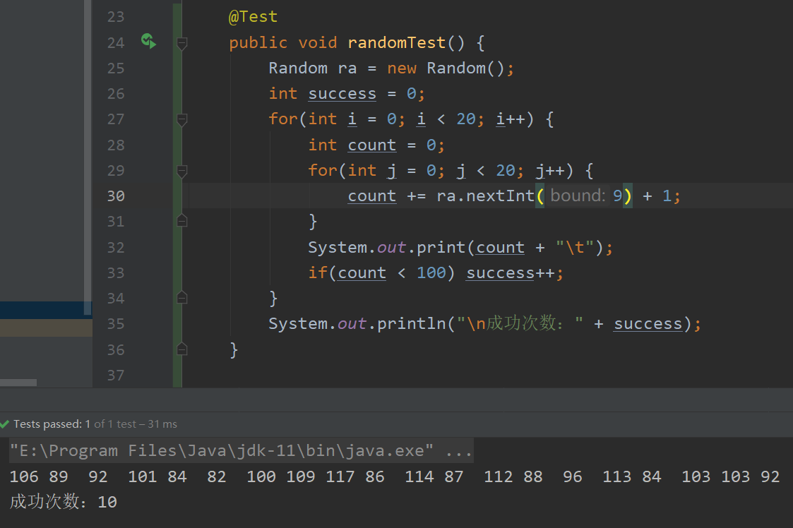

# QQ机器人 农场版

## 前言
本项目复刻了com2us在十年前左右开发的一款J2ME平台的手机游戏“开心农场”（国内称“韩版开心农场”）的一部分功能，并根据平台特性添加了一些原本没有的功能，修改了一些原有功能的逻辑。

请参阅：[更新记录](./updateLog.md)&emsp;[命令用法](./command.md)&emsp;[作物图鉴](./crops.md)

## 内容和基本逻辑
主要内容为购买种子、培养作物、收获作物、卖出作物。

使用前，你需要先进行注册操作，以获取你所在的地理位置，与此地理位置的地形。你可以更新你所在的地理位置，但是只能在<strong>上次更新的10天后</strong>再修改。

共有三种地形：平原、沿海、山地。

### 作物

共有48种作物，每种地形有16种，这16种作物又根据适合生长的季节不同，每个季节分为4种。

你需要在种子商店中购买作物的种子，然后播种。

作物有适合生长的地形与季节，若作物生长在不适合它生长的季节或地形中，它的生长质量会逐渐下降，当生长质量低于一定值时，作物损坏。

此外，若是遇到极端天气（如大雨、暴雨），也会影响作物的生长质量。

作物需要定时浇水，水的消耗量与作物所在地的天气有关，越接近晴天，水的消耗量越多，越接近雨天，水的消耗量越少，雨很大时，还可以不用浇水，余水量会自动增加。

作物会在一段时间后成熟，此时可以进行收获，若不及时收获，它仍然会一直消耗水量，也可能会损坏。

为了避免不劳而获，每个用户只能在距离上次播种不到1天的时间内进行收获。

作物果实可以一直保留，果实在不同的地区和不同的季节售卖时，售价会有提升。

### 用户

每个不同的地理位置有不同的商店和土地，在同一个地理位置的用户所使用的商店和土地是相同的。

作物播种后是<strong>没有归属的</strong>，在同一个地理位置的任何人都可以对该地理位置的任何作物进行浇水、收获。

每个用户的起始资金为5000。

每个用户初始等级为1，用户可以花费资金来升级，等级越高，水桶和背包的容量越大。

每个用户浇水的可用水量是有限的，当余水量不足时，可以进行打水操作，该过程需要30分钟，期间不能进行除了查询以外的其他操作。

如果用户资金太少（少于1000），又没有果实和种子可以进行操作，系统会在0点为低资金用户发放3000的资金补贴。

### 火车票
除了可以在现实中移动位置时手动更新地理位置外，还可以通过购买火车票的方式来更改你的地理位置。火车票的数据来源自12306，除了虚拟的价格外，完全与现实中的列车车次相同。

购买车票后，你需要在适当的时间执行上车操作，否则车票作废。

在列车到站前，你不能执行除查询以外的任何其他操作，列车到站后，即更新你的地理位置，你就可以在新的地点购买种子，使用土地，售卖果实了。


## 时间周期
项目的定时任务采用的是cron表达式，故每次定时任务将在固定的时间点进行。
### 种子商店刷新 
~~每3小时一次，分别在0、3、6、9、12、15、18、21点整进行。~~

每小时一次，整点进行。
### 天气刷新
每10分钟一次，分别在每个小时的5、15、25、35、45、55分进行。
### 作物生长
作物每10分钟消耗一次水，每40分钟提升一次等级，当作物达到6级时即可收获，即从播种到收获，大约需要200分钟（3小时20分钟）。

分别在每个小时的0、10、20、30、40、50分进行。

## 参数
目前，用户的种子背包、果实背包、每个地区的商店商品数、每个地区的土地可容纳的作物数<strong>均为10</strong>。

用户浇水可用水量最大值为200。

### 水量消耗与天气的关系
```java
private static final Map<String, Integer> waterDecMap = new HashMap<>() {{
    put("晴", 20); put("阴", 10); put("多云", 15); put("阵雨", 5);
    put("小雨", 0); put("中雨", -10); put("大雨", -20); put("暴雨", -30);
    put("雨夹雪", 0); put("小雪", 0); put("中雪", -10); put("大雪", -20);
}};
```

### 生长质量消耗与天气的关系
```java
private static final Map<String, Integer> qualityDecMap = new HashMap<>() {{
    put("大雨", 10); put("暴雨", 20);
    put("中雪", 10); put("大雪", 20);
}};
```

### 生长质量消耗与地形和季节的关系
```java
//判断季节
Random ra = new Random();
if(!crop.type.season.equals(Season.getSeason(new Date())))
    dec += ra.nextInt(9) + 1;
//判断地形
if(!crop.location.landform.equals(crop.type.landform))
    dec += ra.nextInt(9) + 1;
```
作物处在不适宜的季节与不适宜的地形时，每次生长随机消耗1~9的生长质量，不适宜的季节与地形产生的消耗可以叠加。

种植不适宜季节或不适宜地形的作物是不被推荐的，所以这样的种植方式不会有很高的成功率。

20次不适宜季节的种植测试，每个作物的质量总消耗如下：

